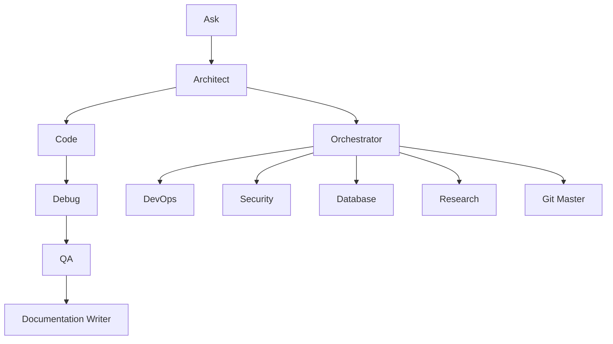

# Kilo-Prompt
[](https://opensource.org/licenses/MIT)
[](https://github.com/your-repo/kilo-prompt/releases)
[](https://github.com/your-repo/kilo-prompt/actions)
[](https://github.com/your-repo/kilo-prompt/issues)
[](https://github.com/your-repo/kilo-prompt/stargazers)

A comprehensive system for defining and managing specialized AI assistant modes for software development tasks. Kilo-Prompt provides a modular framework where each mode has specific capabilities, roles, and restrictions to handle different aspects of the development workflow.
## Table of Contents
- [Overview](#overview)
- [Available Modes](#available-modes)
  - [Ask Mode](#ask-mode)
  - [Architect Mode](#architect-mode)
  - [Code Mode](#code-mode)
  - [Debug Mode](#debug-mode)
  - [Orchestrator Mode](#orchestrator-mode)
    - [Enhanced Orchestration](#enhanced-orchestration)
  - [QA Mode](#qa-mode)
  - [Documentation Writer Mode](#documentation-writer-mode)
  - [DevOps Mode](#devops-mode)
  - [Security Mode](#security-mode)
  - [Database Mode](#database-mode)
  - [Research Mode](#research-mode)
  - [Git Master Mode](#git-master-mode)
  - [Usage](#usage)
- [Installation](#installation)
- [Configuration](#configuration)
- [Contributing](#contributing)
- [License](#license)
## Overview
Kilo-Prompt is designed to enhance AI-assisted software development by providing specialized modes that excel in specific domains. Each mode is configured with:
- **Role Definition**: Clear persona and expertise area
- **Capabilities**: Specific tools and permissions available to the mode
- **Restrictions**: File type limitations and operational boundaries
- **Custom Instructions**: Specialized guidance for optimal performance
The system uses YAML configuration files to define each mode, making it easy to customize, extend, and maintain different AI assistant personalities for various development tasks.

## Mode Relationships
The following diagram illustrates how different modes typically interact in a development workflow:


## Available Modes
### Ask Mode
**Purpose**: Get answers and explanations about software development topics
**Capabilities**:
- Answer technical questions
- Explain concepts and technologies
- Analyze existing code
- Provide recommendations
- Access external resources
**When to Use**: When you need explanations, documentation, or answers to technical questions without making code changes.
**Restrictions**: Read-only access, cannot modify files.
### Architect Mode
**Purpose**: Plan and design before implementation
**Capabilities**:
- Information gathering and context analysis
- Technical planning and specification creation
- System architecture design
- Todo list creation and task breakdown
- Workflow planning with Mermaid diagrams
**When to Use**: For complex problems requiring detailed planning, technical specifications, or system architecture design.
**Restrictions**: Can only edit Markdown files (.md).
### Code Mode
**Purpose**: Write, modify, and refactor code, explicitly delegating testing responsibilities
**Capabilities**:
- Full code editing and creation
- Multi-language support
- Code refactoring and optimization
- File system operations
- Command execution
- Initiating tasks in QA mode for comprehensive testing and feedback
**When to Use**: When implementing features, fixing bugs, or making code improvements across any programming language. It delegates testing to QA mode for verification.
**Restrictions**: Full access to edit any file type.
### Debug Mode
**Purpose**: Diagnose and fix software issues
**Capabilities**:
- Systematic problem diagnosis
- Error analysis and root cause identification
- Logging and debugging strategies
- Code inspection and troubleshooting
- Stack trace analysis
**When to Use**: When troubleshooting issues, investigating errors, or diagnosing problems in existing codebases.
**Restrictions**: Full access to edit any file type.
### Orchestrator Mode
**Purpose**: Coordinate tasks across multiple modes
**Capabilities**:
- Complex task decomposition
- Multi-mode coordination
- Workflow management
- Progress tracking
- Subtask delegation
**When to Use**: For complex, multi-step projects requiring coordination across different specialties and expertise areas.
**Restrictions**: Limited direct editing capabilities, focuses on coordination.
### Enhanced Orchestration
The Orchestrator mode has been significantly enhanced to proactively engage specialized modes (QA, Debug, Documentation Writer) throughout the project lifecycle. This ensures comprehensive handling of tasks from development to deployment and maintenance.

- **Proactive Triggers**:
  - **QA Mode**: Triggered automatically after code changes or new feature implementations to ensure quality and adherence to best practices.
  - **Debug Mode**: Activated upon detection of errors, issues, or unexpected behavior to diagnose and resolve problems efficiently.
  - **Documentation Writer Mode**: Engaged for new feature development or modifications to existing functionalities, ensuring documentation remains accurate and up-to-date.

The Orchestrator explicitly considers these phases when breaking down complex tasks, offering a robust, end-to-end development workflow. It will also use follow-up questions to involve the user in decisions about including "optional" phases like comprehensive QA cycles or extensive documentation updates, providing flexibility and control over the development process.
### QA Mode
**Purpose**: Ensure code quality, reliability, and enforce best testing practices
**Capabilities**:
- Comprehensive code review and analysis
- Implementation of mandatory real test execution and verification protocols
- Security vulnerability detection and reporting
- Performance issue identification and optimization recommendations
- Detailed code quality assessment and adherence to standards
- Providing structured feedback and test results to Code mode
**When to Use**: When thorough testing, quality assurance, compliance with testing mandates, and verification protocols are required.
**Restrictions**: Full access to edit any file type.
### Documentation Writer Mode
**Purpose**: Create clear, comprehensive technical documentation
**Capabilities**:
- README file creation
- API documentation
- Technical guides and manuals
- Code documentation
- User manuals
**When to Use**: When creating or updating documentation files, technical guides, or any documentation that helps users understand the project.
**Restrictions**: Can only edit Markdown files (.md).
### DevOps Mode
**Purpose**: Manage infrastructure, deployments, and operational tasks
**Capabilities**:
- Infrastructure as code management
- CI/CD pipeline configuration and optimization
- System monitoring and alerting setup
- Deployment automation
- Container orchestration
**When to Use**: For DevOps tasks such as automating deployments, managing infrastructure, configuring monitoring, or optimizing operational workflows.
**Restrictions**: Full access to edit configuration and infrastructure files.
### Security Mode
**Purpose**: Analyze and improve security posture of applications and systems
**Capabilities**:
- Vulnerability scanning and assessment
- Security audit and compliance checks
- Code security analysis
- Authentication and authorization implementation
- Security best practices recommendations
**When to Use**: When performing security assessments, fixing vulnerabilities, implementing security measures, or ensuring compliance with security standards.
**Restrictions**: Read-only access for sensitive configuration files; can suggest but not directly modify security-critical settings.
### Database Mode
**Purpose**: Design, optimize, and manage database systems
**Capabilities**:
- Database schema design and optimization
- Query performance analysis and tuning
- Data migration and backup strategies
- Database administration tasks
- Indexing and partitioning recommendations
**When to Use**: For database-related tasks such as designing schemas, optimizing queries, managing data migrations, or administering database systems.
**Restrictions**: Full access to edit database-related files and scripts.
### Research Mode
**Purpose**: Research technologies, gather information, and analyze solutions
**Capabilities**:
- Technology research and documentation
- API exploration and integration analysis
- Comparative analysis of tools and frameworks
- Best practices research
- Information synthesis and summarization
**When to Use**: When researching new technologies, exploring API capabilities, comparing solutions, or gathering information for decision-making.
**Restrictions**: Read-only access; cannot modify files or execute commands.
### Git Master Mode
**Purpose**: Manage Git repositories and version control operations
**Capabilities**:
- Repository initialization and configuration
- Branching and merging strategies
- Merge conflict resolution
- Collaborative development workflows
- Git best practices implementation
**When to Use**: When managing Git repositories, handling version control operations, resolving merge conflicts, or implementing branching strategies for software development projects.
**Restrictions**: Full access to edit any file type.
## Usage
### Basic Usage
1. **Choose the Right Mode**: Select the mode that best fits your current task based on the descriptions above.
2. **Provide Clear Instructions**: Give specific, actionable instructions to the AI assistant in the chosen mode.
3. **Review and Iterate**: Review the output and provide feedback for refinements.
### Example Workflow
```bash
# For a new feature implementation:
1. Use Architect mode to plan the feature
2. Switch to Code mode to implement
3. Use QA mode to review the code
4. Use Documentation Writer mode to update docs
```
### Mode Switching
Most modes can request to switch to other modes when needed. For example:
- Architect mode can switch to Orchestrator for complex projects
- Code mode initiates QA mode for comprehensive testing and feedback
- Any mode can switch to Documentation Writer for documentation tasks

## Quick Start
Get up and running with Kilo-Prompt in minutes.

### Prerequisites
- An AI assistant platform that supports custom mode configurations (e.g., GitHub Copilot, VS Code extensions)
- YAML parser for configuration files
- Access to basic tool groups (read, edit, browser, command)

### Simple Workflow Example
1. **Clone the repository**: Download or clone the Kilo-Prompt configurations.
2. **Choose a mode**: Start with [Ask Mode](#ask-mode) for questions or [Code Mode](#code-mode) for implementation.
3. **Load configuration**: Point your AI assistant to the desired YAML file (e.g., `code.yaml`).
4. **Begin working**: Provide clear instructions and let the specialized mode handle the task.

### Common Starting Points
- **New to development?** Try [Ask Mode](#ask-mode) for explanations.
- **Planning a project?** Use [Architect Mode](#architect-mode).
- **Writing code?** Switch to [Code Mode](#code-mode).
- **Debugging issues?** Activate [Debug Mode](#debug-mode).

## Installation
Kilo-Prompt is a configuration-based system that doesn't require traditional installation. To use:
1. **Clone or download** the repository containing the mode configurations
2. **Configure your AI assistant** to use the appropriate YAML files
3. **Load the desired mode** based on your current task
### Prerequisites
- AI assistant platform that supports custom mode configurations
- YAML parser for configuration files
- Access to the defined tool groups (read, edit, browser, command, etc.)
## Configuration
Each mode is defined in a separate YAML file with the following structure:
```yaml
customModes:
  - slug: mode-name
    name: "Display Name"
    iconName: codicon-icon-name
    roleDefinition: "Detailed role description"
    whenToUse: "When to use this mode"
    description: "Brief description"
    groups:
      - read
      - edit
      - browser
      - command
      - mcp
    customInstructions: "Specific guidance for the mode"
    source: project
```
### Customizing Modes
To create a new mode or modify existing ones:
1. Create a new YAML file or edit existing ones
2. Define the mode properties according to your needs
3. Configure appropriate tool groups and restrictions
4. Add custom instructions for specialized behavior
## Contributing
We welcome contributions to improve and extend Kilo-Prompt! Here's how you can contribute:
### Adding New Modes
1. Create a new YAML file in the root directory
2. Follow the established configuration format
3. Ensure the mode has a clear, unique purpose
4. Test the mode configuration thoroughly
### Improving Existing Modes
1. Review the current mode definitions
2. Identify areas for improvement
3. Update the YAML configuration files
4. Ensure backward compatibility
### Documentation
1. Keep documentation up-to-date with code changes
2. Add examples and usage patterns
3. Include troubleshooting guides when applicable
### Guidelines
- Follow YAML formatting standards
- Provide clear, concise descriptions
- Test mode configurations before submitting
- Ensure new modes don't duplicate existing functionality unnecessarily
## Recent Updates
### Refactored Mode Responsibilities (Date: 2025-09-17)
- **Code Mode**: Updated to focus solely on implementation, delegating all testing practices and verification protocols to QA Mode.
- **QA Mode**: Enhanced to incorporate mandatory real test execution, comprehensive verification protocols, and structured feedback mechanisms. QA Mode now serves as the primary authority for ensuring code quality and adherence to testing standards.
- **Workflow Change**: Code Mode explicitly initiates QA Mode for testing coordination after implementation, streamlining the development and quality assurance process.
### Latest Changes (Commit: "Add new mode files and update existing ones")
- **New Modes Added**:
  - **Git Master Mode**: Specialized mode for Git version control and repository management, including branching, merging, and conflict resolution.
- **Updated Modes**:
  - **QA Mode**: Enhanced with full file editing capabilities and improved collaboration features with Code mode.
  - **Documentation Writer Mode**: Refined role definition and custom instructions for better documentation practices.
- **Configuration Improvements**:
  - Removed legacy `.kilocodemodes` configuration file.
  - Transitioned to individual YAML files for each mode for better maintainability and modularity.
## License
This project is licensed under the MIT License - see the [LICENSE](LICENSE) file for details.
---
**Kilo-Prompt** - Specialized AI assistance for every development task.